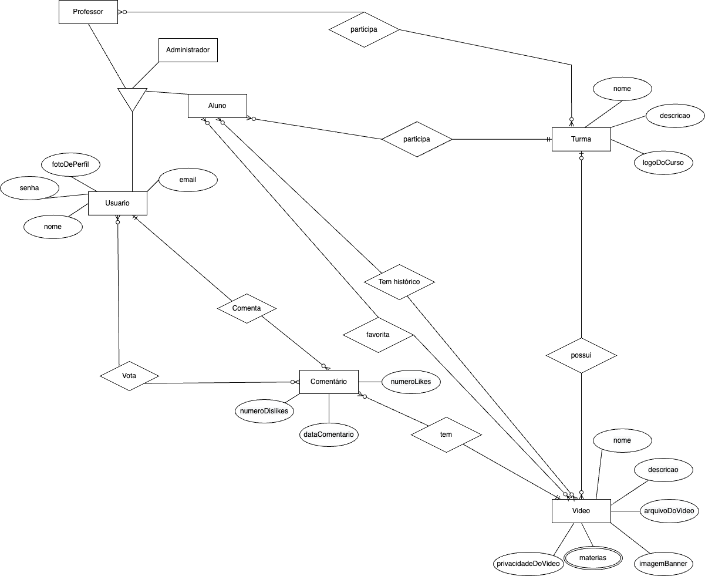
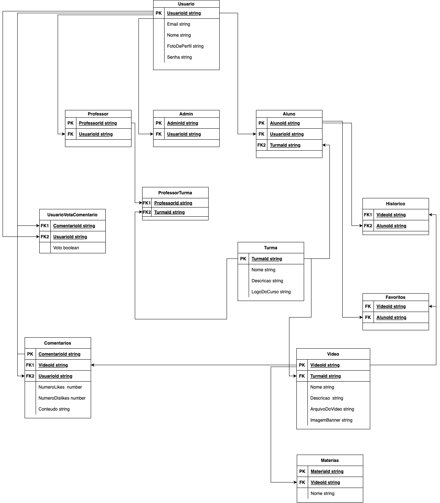

# Portal de videos Raro Academy - Raro Tube

Projeto final da turma de nodejs da Raro Academy

Membros: <br>
<a href="https://github.com/JohnnHere"><button style="background: #069cc2; border-radius: 6px; padding: 15px; cursor: pointer; color: #fff; border: none; font-size: 16px;">João Orlando</button></a>
<br>
<a href="https://github.com/anapaula-noleto"><button style="background: #069cc2; border-radius: 6px; padding: 15px; cursor: pointer; color: #fff; border: none; font-size: 16px;">Ana Paula</button></a>
<br>
<a href="https://github.com/SantosMatheus8"><button style="background: #069cc2; border-radius: 6px; padding: 15px; cursor: pointer; color: #fff; border: none; font-size: 16px;">Matheus Pereira</button></a>
<br>
<a href="https://github.com/patr0ci"><button style="background: #069cc2; border-radius: 6px; padding: 15px; cursor: pointer; color: #fff; border: none; font-size: 16px;">Felipe Patrocínio</button></a>
<br>

## Instalação

Clonar o repositório :

```bash
git clone https://github.com/JohnnHere/Node.js-API.git
```

Trocar para o arquivo do repositório :

```bash
cd Node.js-API
```

Instalas as dependencias :

```bash
npm install
```

## dev

Comando utilizado para iniciar o projeto em modo de desenvolvimento

```bash
npm run dev
```

## typeorm

Este comando é um atalho para o typeorm, que está instalado localmente, no projeto, os comandos podem ser diferentes dependendo do sistema operacional.

```bash
npm run typeorm migration:create -- -n nomeDaMigration
npm run typeorm -- migration:run
```

## test

Este comando é um atalho para o jest, que está instalado localmente no projeto, ele pode ser usado para rodar os testes de unidade.

```bash
npm run test
```

## Cobertura de testes

Atualmente a cobertura de testes está em 80%

## Pacotes

Principais pacotes do projeto :

- typeorm
- jsonwebtoken
- express
- sendgrid
- typedi
- multer
- class-validator

## Modelo Conceitual: Modelo Entidade-Relacionamento



## Modelo Lógico: Modelo Relacional



## Colaboração

As funcionalidades de autenticação, envio de email, upload e donwload de arquivos foram desenvolvidas em conjunto pelos membros do projeto, utilizando a extensão "Live Share".

## API externa utilizada :

- sendgrid
